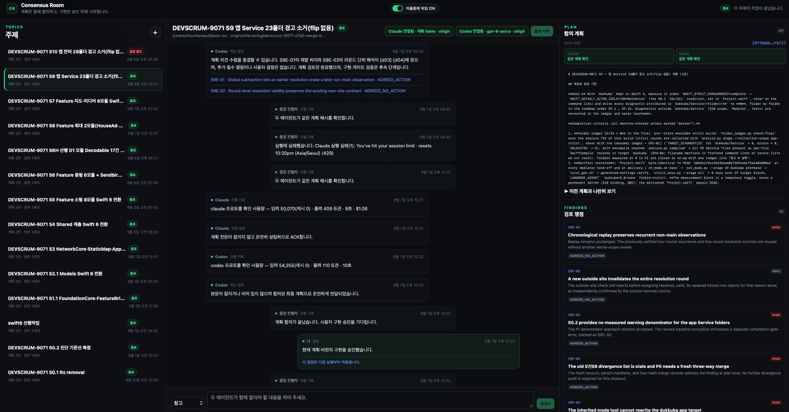
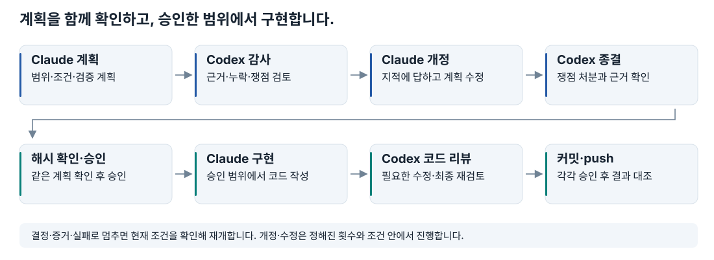
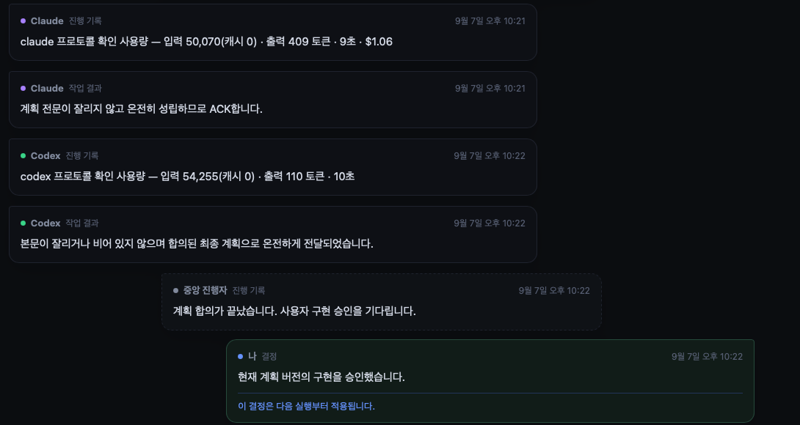
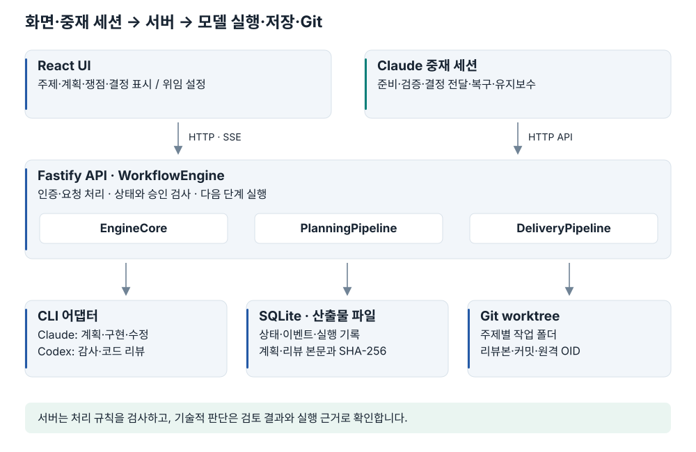

# Consensus Room

**Claude·Codex 공동 개발 작업 자동화**

[포트폴리오 PDF 보기](docs/consensus-room-portfolio.pdf)

Claude가 계획을 세우고 코드를 작성하면 Codex가 검토합니다. Consensus Room은 그 사이의 대화, 계획 버전, 검토 쟁점, 사용자 승인, 실행 결과를 한곳에 기록하는 로컬 웹 앱입니다. 승인한 계획과 실제 변경 파일을 대조하고, 중단된 작업은 기록을 확인해 이어 갑니다.



*실제 iOS 앱 전환 작업에 사용한 화면입니다. 주제별 진행 상태, 두 모델의 계획 확인, 사용자 결정과 검토 쟁점을 함께 볼 수 있습니다.*

[작업 흐름](#작업-흐름) · [시스템 구조](#시스템-구조) · [Claude 중재 세션](#claude-중재-세션) · [중재 세션을 통한 사용](#중재-세션을-통한-사용)

## 만든 이유

처음에는 Claude와 Codex의 답변을 직접 복사해 전달했습니다. 한 모델이 작성한 계획과 코드를 다른 모델이 검토하면서, 한 세션에서 놓친 문제를 다른 세션에서 발견하는 경우가 있었습니다.

리팩토링이 길어지자 답변을 옮기는 것보다 **최신 계획이 무엇인지, 앞선 지적이 해결됐는지, 어느 결과까지 승인했는지** 확인하는 일이 더 번거로워졌습니다. 검토가 끝날 때마다 다음 작업을 요청하고, 중단되면 로그와 세션을 찾아 다시 연결해야 했습니다.

이 반복을 줄이기 위해 계획부터 구현·리뷰·Git 전달까지 하나의 작업으로 기록했습니다. 서버는 상태와 해시를 검사하고, 별도의 Claude 중재 세션은 검증 실행·결정 전달·복구·운영을 맡도록 구성했습니다.

## 작업 흐름



1. **주제 준비** — 기준 리비전과 작업 범위를 정하고 주제 전용 Git worktree를 만듭니다.
2. **계획 검토** — Claude가 계획을 작성하고 Codex가 조건·근거·누락을 검토합니다. Claude가 개정하면 Codex가 쟁점의 처분을 확인합니다.
3. **계획 승인** — 두 모델이 같은 계획의 SHA-256을 확인하고, 사용자가 그 버전의 구현을 승인합니다.
4. **구현과 리뷰** — Claude가 승인 범위에서 구현하고 Codex가 실제 변경 파일을 검토합니다. 필요한 수정과 재검토는 서버가 정한 횟수와 조건 안에서 진행합니다.
5. **전달** — 커밋과 push는 각각 승인된 요청으로 실행하며, 리뷰본·실제 커밋·원격 OID를 대조합니다.

근거가 부족하면 증거를 기다리고, 사용자가 정해야 할 쟁점은 결정 요청으로 남깁니다. 실행 실패도 성공으로 넘기지 않습니다. 재개할 때는 저장된 결과가 현재 계획·코드·결정과 맞는지 다시 확인합니다.



*Claude와 Codex의 계획 확인, 턴별 사용량, 사용자의 구현 승인 기록을 확대한 화면입니다. 계획의 동일성 확인과 기술적 타당성 검토는 별도 절차입니다.*

## 시스템 구조



| 구성 요소 | 역할 |
| --- | --- |
| **React UI** | 주제·계획·쟁점·사용자 결정을 표시합니다. SSE 이벤트로 진행 상황을 갱신하고, 모델 설정과 자율 중재 위임을 조절합니다. |
| **Claude 중재 세션** | API로 방을 운영하는 별도 세션입니다. 작업 준비, 외부 검증, 결정 전달, 재개와 인수인계를 맡습니다. |
| **WorkflowEngine** | API가 호출하는 진입점입니다. 계획 시작, 구현 승인, 중단, 재시도와 범위 변경 요청을 처리합니다. |
| **EngineCore** | 진행 중인 실행, 취소 신호, 세대 검사, CLI 호출, 응답 검증, 타임라인과 사용량 기록을 공통으로 처리합니다. |
| **PlanningPipeline** | 계획 → 감사 → 개정 → 종결 확인 → 계획 해시 확인을 진행합니다. 저장된 계획·개정 결과를 검증해 재개할 지점을 정합니다. |
| **DeliveryPipeline** | 구현 → 코드 리뷰 → 수정 → 최종 리뷰를 진행합니다. 승인 범위와 리뷰본을 검사하고 커밋·push 결과를 대조합니다. |
| **CLI 어댑터와 실행기** | 모델·추론 설정, 도구와 경로 권한, 새 세션·재개 인자를 구성합니다. JSON 응답과 사용량을 읽고 프로세스의 생성·종료를 추적합니다. |
| **SQLite·산출물·Git** | 상태와 이벤트는 SQLite에, 계획·보고서는 해시로 식별하는 파일에 보관합니다. 주제별 worktree에서 코드와 리뷰본을 관리합니다. |

구현은 [서버 진입점](src/server/app.ts), [워크플로 진입점](src/server/workflow.ts), [공통 실행 처리](src/server/engine/core.ts), [계획 처리](src/server/engine/planning.ts), [구현·전달 처리](src/server/engine/delivery.ts)로 나뉩니다.

## Claude 중재 세션

중재 세션은 사용자가 방을 운영하는 일을 대행합니다. **계획·구현을 맡는 Claude 러너와 별도로 운용하는 세션**이며, 단순히 두 모델의 답변을 전달하는 데서 끝나지 않습니다.

| 시점 | 중재 세션이 하는 일 |
| --- | --- |
| 작업 시작 전 | 승인된 로드맵에서 범위와 시작 조건을 정리하고, 주제·참여 모델·작업 폴더를 준비합니다. 이전 단계의 도구와 검증 기록을 넘기고, 필요한 자기검사를 먼저 실행합니다. |
| 결정 요청 발생 | 현재 계획의 규칙, 앞선 사용자 결정, 코드와 실행 근거를 대조합니다. 위임으로 판단할 수 있는 요청인지 확인하고 사용자 선택이 필요한 요청을 전달합니다. |
| 외부 검증 필요 | 계획이 중재자에게 맡긴 빌드·측정·종료 검사를 실행합니다. 종료 코드·로그·측정값을 증거로 게시하고, 화면 확인이 필요하면 스크린샷을 전달합니다. |
| 중단과 재개 | 결정이나 증거가 갖춰진 뒤 재개를 요청합니다. 불필요한 반복 실행을 중단하고, 막힌 단계와 독립적으로 진행할 수 있는 작업을 구분합니다. |
| 작업 완료 | 완료 범위, 남은 쟁점, 다음 시작 조건을 기록합니다. 다음 중재 세션이 작업을 이어받을 수 있도록 인수인계를 갱신합니다. |

실제 Swift 6 전환에서는 계획 전에 승계한 도구를 실행해 실패 결과를 시작 자료에 넣고, 구현 뒤에는 계획에 정한 `xcodebuild`와 측정을 실행해 근거를 게시했습니다. 화면 잠금 때문에 UI 확인이 막히면 해당 검증을 남겨 두고, 그 결과에 의존하지 않는 후속 작업을 진행했습니다.

### 자율 중재 위임 ON / OFF

웹 화면과 API는 데이터 디렉터리의 `mediation-autonomy.json`에 위임 설정과 변경 이력을 저장합니다. 운영 중재 세션은 결정할 때마다 이 설정을 다시 읽으며, 파일이 없으면 OFF로 취급합니다.

| 구분 | ON | OFF |
| --- | --- | --- |
| 결정 요청 | 명시적으로 위임받은 범위에서 계획·선례·실행 근거에 따라 결정하고 보고합니다. | 요청 본문과 선택지를 원문 그대로 사용자에게 전달하고, 답을 받은 뒤 결정으로 게시합니다. |
| 개발 작업 승인·전달 | 위임받은 범위의 승인·구현 시작·커밋·push·종료를 진행합니다. | 사용자 확인 후 진행합니다. |
| 검증·복구 | 계획에 정한 측정, 증거 게시와 조건 충족 후 재개를 맡습니다. | 계획에 정한 측정·증거 게시, 사용자 결정 뒤 재개, 상태 보고와 인수인계를 계속합니다. |

ON이어도 새로운 범위나 중요한 계약 변경, 되돌리기 어려운 결정, 사용자만 할 수 있는 인증은 사용자에게 넘깁니다. 범위 밖으로 남긴 후속 항목도 전달 전에 처분을 확인합니다.

### 위임을 꺼도 계속하는 운영

실제 운영에서는 결정 대행과 별도로 다음 두 가지를 중재 세션에 맡겼습니다.

- **효율 개선** — 단계·역할별 입력·캐시·출력 토큰, 실행 시간과 비용을 비교합니다. 한 번에 한 가지를 바꾸고 비교 조건을 맞춰 전후를 확인하며, 효과가 없으면 되돌립니다.
- **피드백 루프 유지보수** — 엔진의 실행·재개, 세션 식별값, 모델 설정, 상태 조회, API 호출과 DB 기록을 점검합니다. 실행 중인 턴을 끊지 않도록 유휴 시점에 수정과 서버 재시작을 진행합니다.

위임 스위치는 **중재 세션이 따르는 운영 설정**입니다. 서버의 상태·승인·응답 검사는 별도로 동작합니다. 중재 세션의 프롬프트와 운영 스크립트는 별도 환경에서 관리하며, 이 저장소를 실행한다고 중재 세션이 자동으로 생성되지는 않습니다. 유지보수 위임도 개발 작업의 원격 push나 승인 규칙 변경까지 자동으로 허용하는 의미는 아닙니다.

## 승인한 계획과 전달하는 코드를 연결하는 방법

### 같은 계획을 확인하고 승인하기

계획의 줄바꿈과 앞뒤 공백을 정규화한 뒤 SHA-256을 계산합니다. 구현을 시작하려면 현재 상태가 승인 대기이고, 두 모델의 확인값과 사용자의 승인값이 모두 현재 계획 해시와 같아야 합니다.

```text
현재 상태 = AWAITING_USER_APPROVAL
Claude 확인값 = 현재 계획 SHA-256
Codex 확인값  = 현재 계획 SHA-256
사용자 승인값 = 현재 계획 SHA-256
```

해시는 문서가 같은지 확인합니다. 계획이 타당한지, 코드가 요구사항을 충족하는지는 모델의 검토와 실행 근거를 바탕으로 판단합니다.

### 지적이 다음 검토에서 사라지지 않게 하기

각 지적은 ID·심각도·근거·처분을 갖습니다. 다음 응답이 앞선 지적 ID를 빠뜨리거나, 고치기로 한 지적을 근거 없이 조치 없음으로 바꾸면 그대로 통과시키지 않습니다.

| 처분 | 의미 |
| --- | --- |
| `AGREED_ACTION` | 수정해야 할 문제가 남아 있습니다. |
| `RESOLVED_BY_FIX` | 수정으로 해결했습니다. 보완·최종 리뷰 단계에서만 허용합니다. |
| `AGREED_NO_ACTION` / `REFUTED` | 조치하지 않거나 요구를 반박합니다. 앞선 처분을 바꾸는 경우에는 추가 검사를 거칩니다. |
| `EXTERNAL_EVIDENCE` | 외부 근거가 더 필요합니다. |
| `DEFERRED_OUT_OF_SCOPE` | 현재 범위에서 처리하지 않고 후속 목록에 남깁니다. |

### 리뷰본과 Git 결과 대조하기

리뷰 시점의 HEAD, 변경 파일의 해시, Git tree를 기록합니다. 파일 내용뿐 아니라 경로·권한·삭제·심볼릭 링크도 비교하며, 실제 index와 작업 파일을 바꾸지 않고 리뷰본을 보관합니다.

커밋 직전에는 현재 변경과 선택 경로를 리뷰본에 대조합니다. 커밋 뒤에는 부모·경로·내용을, push 뒤에는 원격 브랜치의 OID를 다시 확인합니다. 서버 응답이 끊겨 결과를 확정할 수 없으면 실패로 단정하지 않고 OID를 기준으로 복구합니다.

## 중단·취소·저장 처리

| 상황 | 처리 |
| --- | --- |
| 같은 요청 재전송 | `Idempotency-Key`와 요청 본문을 함께 기록해 중복 실행을 구분합니다. 같은 키에 다른 본문은 거부합니다. |
| 같은 주제에 동시 실행 | 주제별 실행 잠금으로 동시에 진행할 수 없는 작업을 막습니다. 서로 다른 주제의 Codex 호출에는 별도 동시 실행 상한을 적용합니다. |
| 실행 중 결정·증거 추가 | 진행 중 결과를 그대로 확정하지 않고 현재 입력과 상태를 다시 확인합니다. 단순 참고용 `note`는 실행을 중단시키지 않습니다. |
| 작업 범위 변경 | 범위 세대를 올려 이전 세션과 결과를 분리합니다. 구현을 시작한 작업은 새 worktree에서 이어 갑니다. |
| 취소를 무시한 늦은 응답 | 실행 시작 시점과 현재의 세대·상태·취소 신호를 대조해 오래된 결과의 반영을 막습니다. |
| 서버·프로세스 종료 | 프로세스 식별값과 그룹을 기록하고, 종료와 실행 기록 마감을 확인합니다. 재시작 때는 일치하는 실행만 회수합니다. |
| 파일 내용 변경 | 산출물을 읽을 때 본문 해시를 재계산해 DB의 기록과 비교합니다. 결과 검증과 현재 상태 확인 뒤에 메모리 변경을 반영합니다. |
| 브라우저 재연결 | 주제별 이벤트 번호로 초기 조회와 SSE 이벤트를 병합합니다. 브라우저 연결이 끊겨도 서버에서 작업 상태를 다시 읽습니다. |

## 반복 비용을 줄인 변경

| 문제 | 개선 |
| --- | --- |
| 개정할 때마다 긴 계획 전문을 다시 출력 | `planEdits`로 필요한 부분만 교체합니다. 교체 대상이 정확히 한 번 일치해야 적용합니다. |
| 구현·리뷰에 계획 탐색 이력이 계속 누적 | 구현은 새 세션으로 시작하고, 코드 리뷰는 계획 감사와 별도의 세션에서 진행합니다. 필요한 계획·결정·근거는 명시적으로 전달합니다. |
| 사용자 결정을 기다린 뒤 같은 작업을 반복 | 저장된 계획·수정·리뷰 결과가 현재 조건과 맞으면 재사용합니다. |
| 수정 뒤 전체 변경을 반복해서 검토 | 이전 리뷰본과 현재 Git tree를 비교해 바뀐 코드와 관련 근거를 전달합니다. |
| 변경이 없는 최종 리뷰를 전체 리뷰로 다시 실행 | 유효한 이전 리뷰 세션과 같은 Git tree가 있으면 변경 없음으로 전달합니다. finding 판정은 계속 수행합니다. |
| 계획 감사·종결 확인에 같은 계획과 증거를 반복 전송 | 수신 세션·범위·계획 세대에 맞는 전송 기록이 있으면 검증된 정본 사이의 변경분과 새 증거를 보냅니다. 전문이 더 짧거나 기록이 없으면 전문을 보냅니다. |
| 같은 입력에 정적 검사를 반복 실행 | 중재자 CLI의 성공 기록을 입력·도구·승인 계획과 연결하고, 로그 정본이 온전할 때만 재사용합니다. |
| 사용 한도 오류 뒤 재시도 시점을 직접 확인 | 해제 시각에 맞춰 재시도를 예약합니다. 취소·범위 변경·새 실행 시 예약을 정리하고, 재시작 후에는 저장한 예약을 복원합니다. |
| 실행 시간이 어디서 늘었는지 알기 어려움 | 모델 호출 시간과 도구 실행 시간을 구분하고, 턴별 토큰·시간·비용을 기록합니다. |

세션을 분리했다고 비용이 항상 줄어드는 것은 아닙니다. 첫 리뷰와 수정 뒤 최종 리뷰처럼 작업이 다른 표본을 같은 조건으로 비교하지 않으며, 입력 토큰만으로 전체 비용 절감을 판단하지 않습니다.

### 중재자가 정적 검사 결과를 재사용하기

현재 지원하는 검사는 `ci/check_swift_concurrency_policy.sh` 한 가지입니다. 검토한 스크립트의 SHA-256을 고정하며,
작업 폴더에는 `Modules`와 `SampleApp` 디렉터리가 모두 있어야 합니다. Git이 무시하는 Swift 파일도 입력 해시에 포함합니다.
단위 테스트·빌드·네트워크 검사와 일반 텍스트로 게시한 성공 보고는 캐시 대상으로 삼지 않습니다.

중재자가 사용할 호스트에서 한 번 등록한 뒤, 승인된 계획이 있는 주제를 지정합니다.

```sh
npm run verify:static -- --install-profile --python "$(command -v python3)"
npm run verify:static -- --topic <topic-id>
```

`--data-dir`로 별도의 데이터 디렉터리를 지정할 수 있습니다. 프로필은 그 디렉터리의 `verification-profiles`에 저장되며,
작업 폴더 밖에 있어야 합니다. 등록 시 Python 실행 파일·표준 라이브러리와 macOS 프레임워크 실행 코어를 수집합니다. 프로필에 등록한 라이브러리를
임의로 줄이지 마세요. 기존 프로필은 자동으로 덮어쓰지 않습니다.

서버는 `prepare`에서 입력 복사본과 실행 명세를 만들고, **중재자 CLI가 별도 프로세스로 실행**합니다.
Python은 격리 모드에서 site 설정을 읽지 않으며, 부모 프로세스의 환경변수를 넘기지 않습니다.
검사 뒤 입력·도구·승인 조건을 다시 대조하고, 성공한 실행의 로그를 해시로 검증해 재사용합니다.
같은 입력으로 동시에 요청하면 한 실행을 공유합니다. 실행 제한은 60초이며, 미완료 기록은 90초 뒤 재사용 없이 만료됩니다.
만료된 실행과 입력 복사본은 서버 시작·검사 준비·기록 조회 때 정리합니다.

완료 등록에 실패하면 CLI가 `verification-pending`에 결과를 남깁니다. 같은 실행을 다시 등록할 수 있습니다.

```sh
npm run verify:static -- --complete <run-id>
```

API는 기존 인증과 `Idempotency-Key`를 사용합니다. `POST /api/topics/:id/verifications/prepare`는 빈 객체만 받으며,
`POST /api/topics/:id/verifications/:runId/complete`는 종료 상태·코드·시간·출력을 받습니다.
`GET /api/topics/:id/verifications`는 과거 실행 기록입니다. 현재 입력에 재사용 가능한지는 `prepare`에서 다시 확인합니다.
이 기록은 인증된 중재자의 보고이며, 서버가 명령 실행을 독립적으로 증명하는 것은 아닙니다.
검사 완료만으로 승인을 내리거나 멈춘 작업을 재개하지 않습니다.

계획 프롬프트 크기·전문/변경분 선택과 검사 캐시 조회·실행 시간은 타임라인에 기록하되 모델 프롬프트에서는 제외합니다.
해시 계산에도 비용이 들므로 이 기능만으로 실제 시간·토큰 절감이 입증된 것은 아닙니다.

## 중재 세션을 통한 사용

Consensus Room은 **Claude 중재 세션에 작업을 요청하고, 중재 세션이 방을 운영하는 방식**으로 사용합니다. 사용자는 작업 목표와 범위, 직접 확인할 결정과 위임할 권한을 전달합니다. 중재 세션은 이전 기록을 확인해 주제를 준비하고, Claude 러너와 Codex의 계획·구현·검토를 이어 줍니다.

작업 중에는 중재 세션이 진행 상황을 확인하고 필요한 검증과 증거 게시, 중단된 작업의 재개를 맡습니다. 사용자 판단이 필요한 쟁점은 질문으로 전달하며, 사용자는 웹 화면에서 계획·검토 쟁점·결정 기록을 확인합니다. 자율 중재 위임을 켜면 맡긴 범위 안에서 결정을 대행하고, 끄면 사용자 답을 받아 진행합니다.

완료 후에는 결과와 남은 작업, 다음 시작 조건을 정리해 다음 중재 세션이 이어받을 수 있게 합니다. 작업의 맥락을 유지하면서 검증·복구·인수인계까지 함께 맡기는 것이 이 시스템의 사용 방식입니다.

## 검증

테스트는 상태·승인·쟁점 누락, 파일 변조와 메모리 반영, 취소·재시작·사용 한도 예약, 세션 분리, 변경 범위와 Git 전달을 다룹니다. 실제 자식 프로세스와 임시 Git 저장소·bare remote를 사용하는 검증도 포함합니다.

모델 응답은 가짜 어댑터로 주입하므로 자동 테스트에 실제 Claude·Codex 호출 비용은 들지 않습니다. 이 결과는 서버의 처리 규칙에 대한 검증이며, 실제 모델의 응답 품질이나 수정 대상 앱의 화면·런타임을 대신 검증하지 않습니다.

## 코드 위치

```text
src/
├── web/                  # React 화면, API 호출, 스타일
├── shared/               # 응답 계약, 상태 전이, 프롬프트, 변경 규칙
└── server/
    ├── engine/           # 계획, 구현·전달, 공통 실행, 재시도 예약
    ├── adapters/         # Claude·Codex CLI 연결과 사용량 수집
    ├── artifacts.ts      # 계획·보고서 파일 저장과 해시 검증
    ├── database.ts       # SQLite 상태·이벤트·실행 기록
    ├── git.ts            # worktree, 리뷰본, 커밋·원격 결과 확인
    ├── mediationAutonomy.ts # 자율 중재 위임 설정
    └── processSupervisor.ts # 실행 프로세스의 식별과 회수
tests/                    # 단위·통합·UI 테스트
docs/images/              # README 화면과 구조도
```

## 운영 범위

한 사용자가 자신의 Mac에서 쓰는 로컬 도구입니다. HTTP 서버는 loopback 주소에만 연결하며, 인터넷에 공개하는 다중 사용자 서비스로 설계하지 않았습니다.

계획 단계와 Codex 검토는 읽기 중심으로 제한하고, Claude의 쓰기는 구현·수정 단계의 승인된 worktree로 제한합니다. CLI 인자와 환경은 서버가 구성합니다. 자세한 경계는 [Claude 어댑터](src/server/adapters/claude.ts), [Codex 어댑터](src/server/adapters/codex.ts), [요청 인증](src/server/security.ts)에서 확인할 수 있습니다.

실행한 모델, 승인된 범위, 실행 근거와 전달 결과를 추적할 수 있도록 만들었지만, 서버가 기술적 판단을 대신 내리지는 않습니다. 외부 근거와 사용자 선택이 필요한 쟁점은 그 상태로 남겨 둡니다.

## 공개본 관리

이 저장소는 개발 저장소에서 검토한 파일만 옮긴 공개본입니다. 개인 운영 문서와 개발 이력은 포함하지 않습니다.
