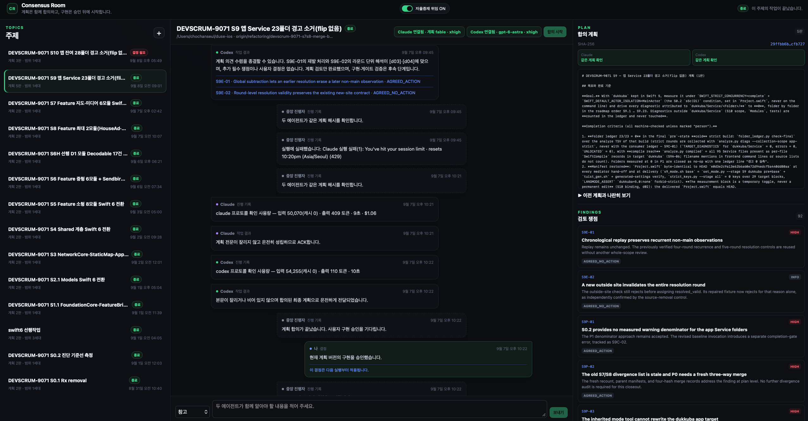
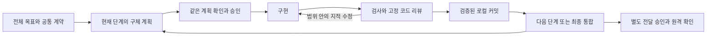
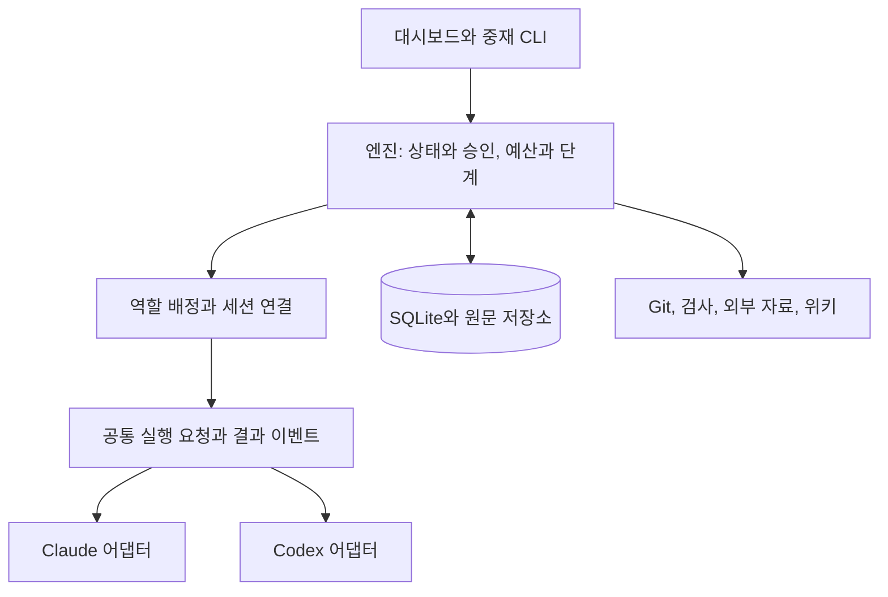

# Consensus Room

**큰 작업을 단계별로 계획하고, AI가 구현·검토한 결과를 확인 가능한 커밋으로 이어 가는 개발 작업 도구입니다.**

처음부터 모든 세부 사항을 설계하지 않습니다. 전체 목표와 공통 계약을 정한 뒤, 지금 실행할 단계만 구체화합니다. 필요한 코드·기획 원문·위키는 그때 찾아 읽고, 다음 단계는 검증된 결과에서 시작합니다. 중재자·설계자·구현자·검토자는 역할이며, Claude와 Codex는 그 역할에 배정할 수 있는 실행 도구입니다.

[설계와 운영 사례 PDF](docs/consensus-room-portfolio.pdf) · [PDF 원문](docs/consensus-room-portfolio.md) · [공유 PDF](https://drive.google.com/file/d/1G8U6Sb6fhkYqDWIRdOstIBdoIf04qMZQ/view)

*위 화면은 기존 운영 사례입니다. 당시의 작업명과 모델 배정이 표시되며, 아래 설명은 2026-09-27 기준 구현을 다룹니다.*

## 해결하려는 문제

AI 도구를 번갈아 쓰면 사람이 계획과 리뷰를 옮겨 적고, 같은 파일을 다시 보내고, 서로 다른 결과를 승인하기 쉽습니다. 큰 입력을 한 번에 전달하려고 요약을 거듭하면 필요한 근거까지 사라집니다. 단계가 너무 잘게 나뉘면 실제 구현보다 전달·승인·리뷰에 더 많은 시간이 듭니다.

Consensus Room은 이 과정을 작업 상태와 근거로 남깁니다. 어떤 계획을 승인했는지, 무엇을 읽고 판단했는지, 어떤 코드가 검토됐는지, 다음 단계가 어느 커밋에서 시작하는지를 연결합니다. 제품 판단이 필요한 질문과 엔진이 계속 처리할 수 있는 수정도 구분합니다.

## 작업이 진행되는 방식

```mermaid
flowchart LR
  G[전체 목표와 공통 계약] --> S[현재 단계의 구체 계획]
  S --> A[같은 계획 확인과 승인]
  A --> I[구현]
  I --> V[검사와 고정 코드 리뷰]
  V --> C[검증된 로컬 커밋]
  C --> N[다음 단계 또는 최종 통합]
  N --> S
  N --> D[별도 전달 승인과 원격 확인]
  V -->|범위 안의 지적 수정| I
```

1. **큰 그림:** 목표, 완료 조건, 단계 사이의 계약을 먼저 정합니다. 미래 단계는 개요로 남깁니다.
2. **현재 계획:** 실행할 단계의 범위·검사·예산·해결해야 할 질문을 구체화합니다. 필요한 원문은 나눠 읽습니다.
3. **계획 확인:** 정규화한 계획의 SHA-256을 대조해 설계·검토·승인이 같은 내용을 가리키게 합니다.
4. **구현과 검토:** 호환되는 배정에서는 계획 세션을 구현까지 이어 씁니다. 별도 검토자는 고정된 코드와 검사 결과를 봅니다.
5. **로컬 완료:** 승인된 계획, 검토한 코드, 실제 커밋이 일치해야 단계가 닫힙니다. 다음 단계는 이 커밋과 결과 묶음을 받습니다.
6. **전달:** 최종 통합을 검증한 뒤 푸시를 별도로 처리합니다. 원격 커밋까지 확인해야 전체 전달이 완료됩니다.

현재 작업을 끝내기 위해 고칠 수 있는 오류는 같은 단계에서 처리합니다. 제품 결정·인증·권한·예산이 실제로 부족할 때는 이유를 남기고 멈춥니다. 단계가 끝났다는 이유만으로 사용자에게 다시 진행 승인을 요구하지 않도록 중재 정책을 구성할 수 있습니다.

## 단계를 얼마나 나누는가

단계의 단위는 **독립적으로 확인할 수 있는 결과**입니다. 파일 수·함수 수·역할 수만으로 단계를 늘리지 않습니다. 같은 결과를 만드는 설계·구현·테스트는 단계 안의 체크리스트로 묶습니다.

분리 이유는 앞 단계의 결과가 있어야 판단할 수 있는지, 따로 검증할 수 있는지, 실패했을 때 별도로 되돌릴 필요가 있는지로 설명합니다. 모든 작업에 같은 단계 수나 시간 상한을 적용하지 않습니다.

- 실행 전인 단계는 추가·분할·병합·순서 변경할 수 있습니다.
- 이미 연결되거나 완료된 단계의 구조를 바꿔 이력을 덮어쓰지 않습니다. 영향을 받는 진행 단계에는 재계획을 연결합니다.
- 변경과 무관한 계획 승인·세션·완료 결과는 보존합니다. 재계획이 실패하면 이전 응답을 새 계획의 결과로 받아들이지 않습니다.
- 기본 실행은 한 단계씩입니다. 외부 정보나 사용자 결정 때문에 기다리는 동안에는 의존하지 않는 준비된 단계를 진행할 수 있습니다. 예산 소진을 다른 단계로 우회하지 않습니다.

## 큰 입력은 필요한 만큼 나눠 읽는다

새 일반 작업은 기본적으로 guarded planning v2를 사용합니다. 전체 파일과 대화를 처음부터 프롬프트에 넣는 대신, 목표·진행 기록·자료 목록·참조를 전달합니다. AI는 서버가 허용한 읽기 도구로 필요한 파일, Git 변경, 저장된 외부 자료와 위키를 조회합니다.

| 장치 | 보장하려는 것 |
|---|---|
| 출처·버전·내용 해시·바이트 위치 | 어느 원문의 어느 부분을 읽었는지 추적 |
| 조각과 묶음 단위의 전달 한도 | 한 호출에 입력을 몰아넣지 않고 다음 위치부터 계속 읽기 |
| 반드시 읽어야 하는 자료의 끝까지 확인 | 일부만 본 상태에서 계획을 확정하지 않기 |
| 실제로 전달한 조각만 인용 허용 | 자료 목록을 본 것과 원문을 읽은 것을 구분 |
| 진전 확인과 누적 사용량 기록 | 같은 조회를 반복하며 비용만 쓰는 흐름을 중단 |

전달 한도는 한 번에 싣는 크기를 조절합니다. 누적 입력이 커졌다는 이유만으로 문서를 잘라 버리거나 세션·예산을 초기화하지 않습니다. 추가 읽기가 남은 완료 응답은 중간 응답으로 처리합니다. 두 번 연속 새 근거나 질문 해결 없이 반복하면 중단 사유를 남깁니다.

같은 세션에서 읽기를 이어 가는 계획·감사에서는 과제 본문·필수 지시문이 한 요청에 들어가지 않으면 필수 원문 참조로 바꿉니다. 기존 청크 읽기로 전체를 전달하고, 끝까지 읽었다는 기록이 있어야 완료를 인정합니다. 큰 디자인 링크 목록도 참조로 읽습니다. 어댑터가 지시문 전체를 다시 붙이지 않도록 전달 책임을 계획 제어에 모았습니다. 세션을 유지하지 않는 구형 계획 방식의 제한은 그대로이며 자동으로 새 방식으로 바꾸지는 않습니다.

실제 컨텍스트 한도나 세션 손실에는 제한된 복구 경로를 사용합니다. 같은 공급자·모델·설정을 유지한 체크포인트 복구와 누적 예산을 적용하며, 단순히 입력이 크다는 이유로 매번 새 세션을 만들지 않습니다. 기존 작업을 새 프로토콜로 자동 변환하지도 않습니다.

자세한 계약: [계획 입력과 원문 읽기](docs/guarded-planning.md)

## 위키와 Figma의 역할

위키는 원문을 필요할 때 찾는 통로입니다. 탐색용 색인과 관련 문서부터 전달하고, 더 필요한 문서는 경로와 버전을 확인해 읽습니다. 색인에 나타났지만 읽지 않은 문서까지 현재 판단의 근거로 등록하지 않습니다. 외부 자료가 바뀌면 관련 결론을 재검토 대상으로 표시하며, 위키의 결론을 자동으로 바꾸지 않습니다.

**계획에는 화면별 Figma 링크와 기능 흐름만 둡니다.** 링크는 디자인을 찾는 위치이며, 레이아웃을 확인했다는 증거가 아닙니다. 계획자가 노드 트리·간격·폰트·색상·스크린샷을 모아 상세 구현 지시로 옮기지 않습니다. 구현자가 해당 화면을 만들 때 링크를 열어 필요한 디자인을 확인합니다. 디자인을 보다가 합의한 기능이나 범위가 달라지는 경우에만 제품 판단을 요청합니다.

자세한 계약: [위키 조회와 검증](docs/memory-retrieval.md)

## Slack·Jira·Figma 갱신과 중복 읽기

등록된 링크만 추적합니다. 외부 자료가 등록되지 않은 작업에는 조회할 대상이 없습니다. 작업 이름을 보고 연결된 전체 워크스페이스를 검색하는 방식은 아닙니다.

REST 수집기는 기본 15분 간격으로 조회 시점을 확인하고, 시작할 때도 조회가 밀렸는지 확인합니다. 닫힌 작업에서만 쓰는 자료는 정기 조회하지 않습니다. 이 수집 과정은 LLM을 호출하지 않습니다. 중재자는 시작·재개할 때 변경분을 받습니다. 커넥터 방식은 연결된 호스트의 수집이 필요하며, REST 인증이 자동으로 공유되는 것은 아닙니다.

| 출처 | 갱신 확인 방법 | 남는 비용과 한계 |
|---|---|---|
| Jira | 수정 시각을 먼저 확인하고, 변화가 있을 때 본문 수집. 댓글은 별도 확인 | 상태·담당자 변경만으로 기획 변경이라고 판단하지 않음 |
| Slack | 등록한 대화의 페이지를 다시 확인해 과거 메시지 수정·삭제도 감지 | API 조회량 자체는 없어지지 않음. 반응만 바뀐 경우는 본문 변경과 구분 |
| Figma | 파일 버전 확인 후 관련 노드 비교. 내용이 같으면 PNG 재수집 생략 | 댓글은 별도 확인. 연결된 외부 라이브러리의 모든 변화를 추적하지는 않음 |

본문·이미지는 내용 해시로 공유 저장하고, 동시 수집은 잠금으로 중복 실행을 줄입니다. AI에 전달한 자료는 작업·역할·세션별로 기록합니다. 실패하거나 취소된 전달은 읽음으로 처리하지 않으며, 새 세션에는 필요한 자료를 다시 전달할 수 있습니다.

자료가 바뀌거나 충분히 오래 확인되지 않았다면, 새 실행이나 결과 수락 전에 영향 확인·재검토·재계획이 필요합니다. 접근 거부나 요청 제한을 오래된 캐시가 최신이라는 근거로 쓰지 않습니다.

**API 조회, 프롬프트에 실리는 바이트, 공급자가 청구하는 입력 토큰은 서로 다른 수치입니다.** 변경 없는 본문을 다시 넣지 않아도 API 호출은 남을 수 있습니다. 캐시 토큰도 무료나 0토큰이라고 가정하지 않습니다.

자세한 계약: [외부 자료 수집·전달](docs/external-evidence.md)

## 역할과 AI 실행 도구를 분리한다

```mermaid
flowchart TB
  UI[대시보드와 중재 CLI] --> E[엔진: 상태와 승인, 예산과 단계]
  E --> R[역할 배정과 세션 연결]
  R --> T[공통 실행 요청과 결과 이벤트]
  T --> C[Claude 어댑터]
  T --> X[Codex 어댑터]
  E <--> D[(SQLite와 원문 저장소)]
  E --> G[Git, 검사, 외부 자료, 위키]
```

| 구분 | 책임 |
|---|---|
| 역할 정책 | 설계·구현·검토에서 허용할 행동과 결과 형식 |
| 실행 프로필 | 공급자·모델·추론 강도·공급자별 옵션 |
| 역할 배정 | 전역 또는 작업별로 누구에게 어떤 역할을 맡겼는지와 그 버전 |
| 세션 연결 | 어느 배정의 대화를 재개하는지 확인 |
| 공통 실행 런타임 | 실행·종료·세션·사용량·오류 이벤트를 같은 계약으로 제공 |
| 호출 주체 | 엔진과 호스트 리뷰가 각자의 승인·상태·누적 예산을 소유 |

현재 구현된 공급자는 **Claude와 Codex 두 개**입니다. 새 공급자는 어댑터와 기능 지원 검증이 필요합니다. 지원하지 않는 옵션을 다른 설정으로 조용히 바꾸지 않으며, 모델·추론 강도를 임의로 낮추지 않습니다. ultracode처럼 공급자에 종속된 옵션은 해당 어댑터의 계약으로 남깁니다.

계획과 구현의 배정이 호환되면 대화를 이어 사용합니다. 리뷰는 별도 판단 맥락을 유지하고, 수정 후에는 같은 리뷰 세션에서 바뀐 내용과 미해결 지적을 확인할 수 있습니다. 배정이 달라진 세션을 이름만 같다는 이유로 재사용하지 않습니다. 중재자 교체에도 작업 기록·미해결 질문·기존 승인을 확인하는 절차를 둡니다.

## 승인, 검증, 커밋을 연결한다

계획 해시는 **같은 내용을 승인했다는 증거**입니다. 계획의 타당성은 별도 검토가 필요합니다. 리뷰 지적에는 ID를 부여해 수정·수용·범위 밖 이관을 추적합니다. 지적이 응답에서 빠지거나 불완전한 리뷰가 돌아왔다고 해결된 것으로 처리하지 않습니다.

구현 후 리뷰는 움직이는 작업 폴더 대신 기준 커밋·후보 커밋·파일 목록·변경 내용을 고정합니다. 수정 뒤에는 바뀐 지적과 영향을 받는 호출부를 확인하며, 같은 전체 리뷰를 매번 새로 시작하지 않습니다. 범위 밖 개선은 기록해 다음 작업으로 넘깁니다.

단계의 완료에는 검토한 트리와 실제 로컬 커밋의 일치가 필요합니다. 단계 결과에는 계획·검사·사용한 위키 버전·남은 질문·이관한 지적을 묶습니다. 분기된 결과를 통합할 때는 충돌 해결 후 검토를 거쳐 부모 커밋을 보존합니다. 최종 통합이 모든 단계의 결과를 포함하는지도 확인합니다.

푸시 응답을 받지 못했더라도 즉시 반복하지 않습니다. 원격 OID를 조회해 이미 반영됐는지 확인하고 전달 상태를 복구합니다. 로컬 완료와 원격 전달 완료를 같은 상태로 취급하지 않습니다.

## 실패해도 판단 근거를 보존한다

- **권한:** 계획·리뷰는 읽기, 구현은 쓰기, 단순 확인 응답은 도구 권한 없이 실행하는 계약을 사용합니다. 역할과 작업에 맞는 범위를 실행 전에 검증합니다.
- **늦은 결과:** 취소·재계획 뒤 도착한 이전 실행의 응답이 최신 상태를 덮어쓰지 못하게 합니다.
- **프로세스:** 출력 문구뿐 아니라 실제 종료와 응답 형식을 확인합니다. 재시작 시 PID와 시작 신원을 확인해 다른 프로세스를 잘못 정리하지 않습니다.
- **사용자 파일 읽기:** 지시문·메모리 파일은 종료 가능한 자식 프로세스가 읽습니다. 파일 접근이 멈추면 5초 기한 또는 턴 취소로 읽기를 끝내고 사유를 남깁니다. 접근 실패를 빈 문서로 취급하지 않으며 운영체제의 접근 권한을 변경하지 않습니다.
- **자료:** 본문 해시로 고정한 자료를 기준으로 삼습니다. 편의를 위한 별칭 파일을 그대로 신뢰하지 않습니다.
- **예산:** 단계·수정·재시작을 거쳐 사용량을 누적합니다. 원문을 여러 번 읽는 논리적 리뷰와 실제 모델 호출의 비용을 구분해 기록합니다. 사용량 누락은 0이 아닙니다.
- **중단 복구:** 서버가 다시 시작하면 모델 실행 전 중단이 확인된 기록만 종료 상태로 정리합니다. 실행 여부나 사용량이 불확실한 기록은 차단을 유지하며, 기록된 사용량과 예산 초과에 따른 정지도 보존합니다.
- **재시도:** 사용량 제한과 실패를 기록하고 취소 가능한 재시도를 사용합니다. 새 작업 ID나 새 세션으로 한도를 초기화하지 않습니다.

## 재사용하는 검사 결과의 범위

검사 재사용은 현재 알려진 **Swift 동시성 정책 정적 검사 한 종류**에 한정됩니다. 검사 대상 입력, 검사 도구와 실행 환경, 승인 계획, 결과 로그의 해시가 맞아야 이전 결과를 사용합니다. Git에 추적되지 않는 관련 Swift 파일도 입력 확인에 포함합니다.

모든 단위 테스트나 빌드를 자동 캐시하는 기능은 아닙니다. CLI가 제출한 검사 보고서와 독립적으로 확인한 실행 증거도 구분해야 합니다. 코드가 같다는 사실만으로 앱의 UI·런타임 동작까지 검증됐다고 보지 않습니다.

## 실제로 확인한 결과와 남은 한계

2026-09-27 기준, 엔진 개편 뒤 격리한 실제 CLI 파일럿에서 다음 흐름을 완료했습니다.

| 확인 항목 | 결과 |
|---|---|
| 단계 실행 | 5개 단계 모두 로컬 완료, 최종 통합 후 격리된 bare 원격에 전달 확인 |
| 진행 중 변경 | 중재자 교체, 미래 단계 분할, 영향 없는 결과 보존, 큰 원문 나눠 읽기 |
| 재시작 | 파일럿 DB 60개 테이블의 상태 보존 확인 |
| 구현 결과 | 최종 대상 프로젝트의 검사 77개 통과, 고의 결함을 넣은 반대 검사에서 실패 확인 |
| 실행 도중 엔진 수정 | 두 번째 파일럿에서 없음. 비교한 엔진 파일 243개의 해시 유지 |
| 모델 실행 | 48회, 입력 22,602,633토큰 중 캐시 입력 18,134,381토큰, 출력 620,113토큰 |
| 모델 실행시간 | 호출별 시간 합계 6,566초. 전체 작업의 경과 시간과는 다름 |

첫 파일럿은 예산 처리와 계획 확정 경로의 결함으로 중단됐습니다. 근거를 보존해 수정·검토한 뒤 새 파일럿을 끝냈습니다. 두 번째 파일럿에도 명시적인 예산 추가와 리뷰 횟수 추가가 있었으므로, 사람의 개입이 전혀 없었던 실행으로 소개하지 않습니다.

외부 자료는 파일럿용 저장 스냅샷으로 검증했습니다. **실제 Slack·Jira·Figma 연결을 모두 사용한 종단 간 실행은 이 결과에 포함되지 않습니다.** 전달 기록은 세션별 읽음 확인을 보여 주지만 실제 재전송 횟수 전체를 증명하지는 않습니다. 이전 엔진과 같은 작업·설정으로 비교한 토큰 절감률도 아직 없습니다.

문서 갱신 전 검증 기준에서 개발본 검사 1,719개 통과, 호스트 리뷰 Python 검사 160개 통과, 공개본 검사 1,381개 통과를 확인했습니다. 개발본에는 예상 실패 2개와 제외 7개가, 공개본에는 제외 3개가 별도로 있습니다. TypeScript 검사와 웹 빌드도 통과했습니다. 테스트 수는 검증 범위를 이해하기 위한 기록이며, 모든 외부 환경에서의 성공을 뜻하지 않습니다.

자세한 측정 기준: [실제 사용량 보고](docs/usage-report.md)

## 코드와 문서 안내

| 관심사 | 주요 위치 |
|---|---|
| 단계 계획·수정·통합 | src/server/workGroups.ts, workGroupService.ts, workGroupAdapter.ts |
| 역할·프로필·세션 배정 | src/shared/roles.ts, src/server/roleAssignments.ts, turnRouting.ts |
| 공통 실행과 공급자 어댑터 | src/server/runtime/, src/server/adapters/ |
| 원문 읽기와 계획 진행 | src/server/guardedPlanning.ts, planningReader.ts, engine/planning.ts |
| 외부 자료·위키 | src/server/evidence/, memoryRetrieval.ts, wikiEvidence.ts |
| 승인·검토·예산 | src/server/engine/, reviewLedger.ts, budgetLedger.ts |
| 검사·프로세스·전달 | verifications.ts, processSupervisor.ts, engine/delivery.ts |
| 화면 | src/web/ — 작업·단계·자료·예산·리뷰 상태 |
| 공개 계약 검사 | tests/ |

React·Vite 대시보드, Node.js·TypeScript 서버, SQLite 상태 저장소, Claude·Codex CLI 어댑터로 구성합니다. 공개 저장소는 검토한 코드·테스트·문서·화면·PDF를 담으며 운영 DB·인증정보·개인 설정·실행 로그는 포함하지 않습니다.

## 공개본 관리

이 저장소는 개발 저장소에서 검토한 파일만 옮긴 공개본입니다. 개인 운영 문서와 개발 이력은 포함하지 않습니다.
