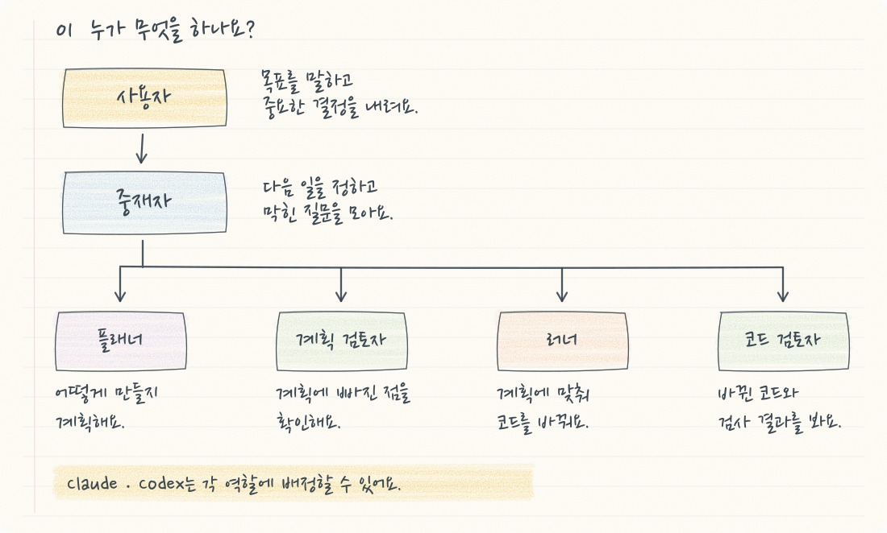
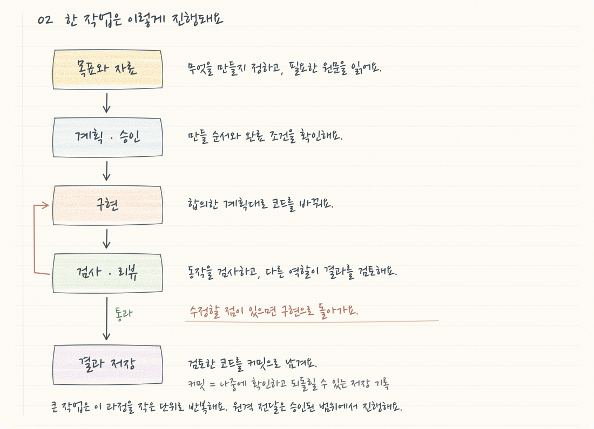
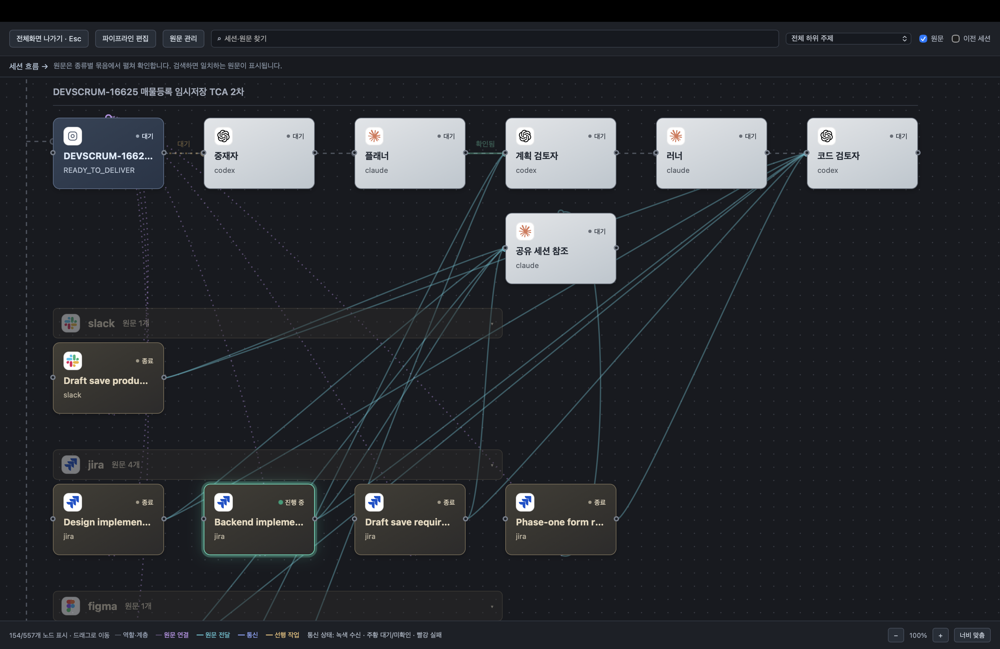

# Consensus Room

**Claude와 Codex가 계획하고, 만들고, 서로 검토하는 과정을 한곳에서 관리하는 개발 작업 도구입니다.**

사람이 AI 사이에서 대화와 자료를 옮겨 주는 수고를 줄이고, **누가 무엇을 근거로 작업했는지** 기록합니다.

## 누가 무엇을 하나요?

## 한 작업은 이렇게 진행돼요

큰 작업은 **결과를 확인할 수 있는 작은 작업**으로 나누고, 지금 할 일부터 구체화합니다. 중재자는 승인된 범위에서 계속 진행하며, 사용자 결정이 필요한 질문은 대화로 돌려줍니다.

## 실제 화면은 이렇게 읽어요

- **위쪽 카드:** 작업을 맡은 역할과 현재 상태입니다. 카드를 누르면 대화와 전달 자료를 확인할 수 있습니다.
- **아래쪽 카드:** 연결한 Slack 대화, Jira 업무 문서, Figma 디자인입니다.
- **연결선:** 점선은 역할·자료의 연결 관계, 청록색 실선은 자료 전달 기록입니다. 자료를 전달했다는 기록과 계획·결과의 승인은 구분합니다.

## 어떻게 시작하나요?

연결된 Claude 또는 Codex 대화에서 목표를 전달합니다. 예를 들면:

> “주문 화면 개선을 consensus-room으로 진행해 줘. 먼저 연결한 기획서와 디자인을 확인해 줘.”

목표가 정해지지 않았다면 논의부터 시작할 수 있습니다. **지시는 대화에서, 진행 확인은 웹 화면에서** 합니다. 기본적으로 시간·토큰 사용량을 기록하며, 사용자가 한도를 정하면 그 한도도 적용합니다.

[설치와 연결](docs/getting-started.md) · [목표·자료·논의로 시작하기](docs/topic-structure.md) · [실제 검증 결과와 한계](docs/usage-report.md) · [설계와 운영 사례 PDF](docs/consensus-room-portfolio.pdf)

## 공개본 관리

이 저장소는 개발 저장소에서 검토한 파일만 옮긴 공개본입니다. 개인 운영 문서와 개발 이력은 포함하지 않습니다.
